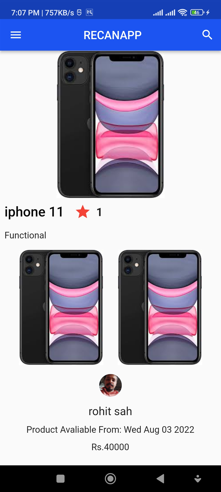

final-assignment-RohitSha1 created by GitHub Classroom
# RECAN (Repair and Refurbished Service)

Buy Product Form Recan for repair with quality porducts fixed by Professionals.

# Description About Recan:
My introduction about my “Recan” android application project using dart & flutters the selling and repairing devices is in more demand due to its supply and cost not in proper whereas the duplication had been replacing the original equipment, so this app will provide you a better detail about gadgets and its parts where new and refurbished gadgets will work same as a new one as well as renew products is cost-efficient and environmentally friendly. If people get the proper information, then the repairable and refurbished will make the crisis and management issues should be decreased.

# Screenshots

  
  

# Features of Recan app are as follows:
Login and Register: Users can create an account and log in to use the exclusive features of this app.
Update: user can update the password and username from the profile sections.
Delete: user can delete the product from the cart page.
Sensor: Users can log in to the app with the help of a fingerprint sensor they don’t need to type email and password as well.
Notification: whenever users login to this app with their account a notification has sent to the top of the bar.
Comment: In the details the reviews and comment are implemented to provide more information.
Likes: In this app the products can be show in profile as a like after uploading form seller from admin talk.
Updates: In this app you can update your profile and details through camera and local storage as well other details like name email and position.
Change Password: Recan has implemented the change password to update the profile details for validation and security purpose.
Subscribe: Here we can follow the person track of products with updates and more on control to information about selling and coming products 
Cart page: Users can add the product to the cart page and can also delete it if they do not like the product as well.
Google Map: for this app, google Maps was also implemented which helps users to find the location of the store.

# ScreenShots

  
  
  
  

# What your application does:
Recan application is a process of buying and selling refurbished items through recan app using an electronic medium such as the internet. users can do any transactions from a smartphone or tablet like mobile banking, or bill payments. Sellers and buyers can virtually meet anytime anywhere there is no need for any intermediaries, and it provides the user with more options to compare and select the cheaper and better option significantly.
# ScreenShots

  
  
  
  

# Why do you use the technology you used?
To build a Recan app various technology were implemented like a flutter, hot reload, android studio, vs code, MongoDB, Node Js, etc. Flutter is the most promising platform by google, which is used to build visually attractive, fast smartphone apps for both Android and iOS platforms.  Hot reload technology helps quickly and easily experiment, build UIs, add, features, and fix bugs. Android Studio provides a unified environment where you can build apps. Vs code is a streamlined code editor with support for development operations. MongoDB is used as a backend database that offers CRUD operation which is useful for working with large sets of distributed data.
Nodejs 
# The challenges faced and features hope to implement in the future.
I hope to use more development dependencies and customs settings also custom UI and authentication implementation where this might be easier in the development process but after applying all the project into authentication, I face lot error where the segment of code is removed while using multiple screen and validations. The changes are turned into custom to template design uses with some screens are customized only. In future in this app or in another project implementation I hope to get some more features in this app where the multiple integration and modern UI with face validation and fingerprint integration as well as payment security with accuracy and fast processing.

# ScreenShots

  
  
  
  

# State management
In this Recan app I have use the state management library and i.e. Flutter_riverpod to sort out form shifting the page into page and with multiple page it helps and benefits with solving errors and time while solving. This is where to pass data around when you’re navigating, but this quickly becomes unmanageable. So Flutter dependencies to use of Inherited Widget as a way to manage global state. Inherited Widget provides a way to look up the widget tree to find a widget and found state Provider”. Under Widget Testing and UI Testing, all we need to do is supply override values. Here it just supply a mock, to test different scenarios. Because we’re injecting the dependency into repos constructor, then unit testing becomes as simple as injecting the mock during a test.

# ScreenShots

  
  

# MVVM
A Flutter MVVM. It uses property-based data binding to establish a connection between the View Model and the View and drives the View changes through the View Model. A Flutter MVVM (Model-View-View Model) implementation. It is a client-side design pattern. It guides the structure and design of your code to help you achieve “Separation of Concerns.” Implementing MVVM requires a bit of a mind-shift in the way you think about the functionality of your application.

# Conclusion:
In my point of view, flutter is the best option as the learning access will become more friendly and well-organized resources and tutors, whereas the college& flutter project is a path for growth in the future. I wanted to build the “Recan” as repair and refurbished products buying and selling through an application which seems wide possibilities I future project development here my first a scalable android application will make a reference and inspiration to build more accurate and cost-efficient app as well as valuable for customer &useful. This project is interesting as my first integration of cashless payment is usable like others deployed applications.

